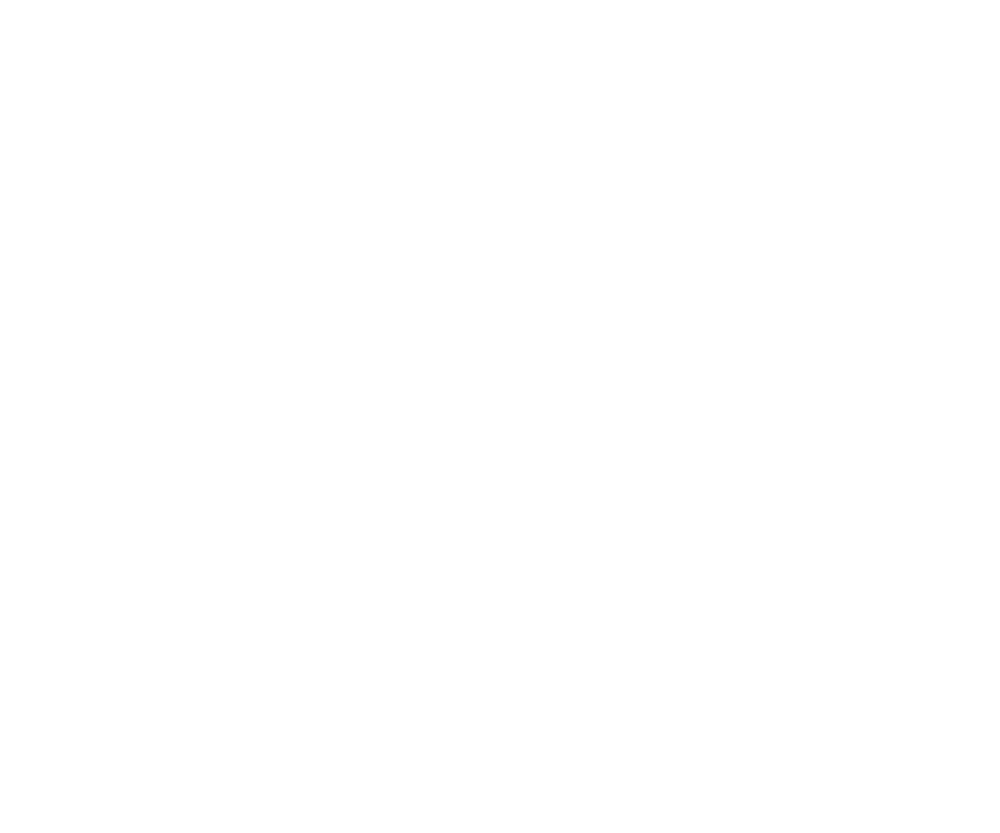

```{r setup, include=FALSE}
knitr::opts_chunk$set(warning = FALSE, message = FALSE)
```

```{r, include=FALSE}
#Importando bibliotecas
library(ggplot2)
library(readr)
library(tidyr)
library(tidyverse)
library(stringr)
library(magrittr)
library(lubridate)
library(knitr)
library(dplyr)
library(kableExtra)
library(GGally)
library(ggplot2)
library(ggcorrplot)
 cores_base <- c("#ABD9E9", "#2C7BB6",'grey')
```

## Introdução

Nesta atividade vocês irão trabalhar com modelos de regressão linear múltipla.


## Atividade

A Organização Mundial de Saúde quer verificar quais fatores influenciam a expectativa de vida. Observou-se que nos últimos 15 anos houve um enorme desenvolvimento no sector da saúde, resultando na melhoria das taxas de mortalidade humana, especialmente nas nações em desenvolvimento, em comparação com os últimos 30 anos. Portanto, neste projeto estão sendo considerados dados dos anos de 2000 a 2015 para 193 países para uma análise mais aprofundada. As variáveis preditoras representam diversos grupos de fatores, ou seja, fatores econômicos e sociais além de fatores relacionados à imunização e mortalidade. 

O conjunto de dados completo está no site [Kaggle > DataSets > Life Expectancy (WHO)]( https://www.kaggle.com/datasets/kumarajarshi/life-expectancy-who/data), mas nós iremos trabalhar com um subconjunto desses dados (arquivo `LifeExpectancyModificado.csv`) que compreende 2095 observações e 11 variáveis preditoras (renomeadas), descritas a seguir:

* `LifeExp`: expectativa de vida (em anos)
* `Developed`: Status do país (Yes = Desenvolvido ou No = em desenvolvimento)
* `Mortality`: taxa de mortalidade para adultos entre 15 e 60 anos
* `BMI`: Índice de Massa Corporal da população
* `Alcohol`: consumo de álcool per capita (em litros)
* `Polio`: cobertura de imunização para Polio entre crianças
* `HIV`: Mortes por HIV/AIDS por 1000 nascidos vivos
* `GDP`: Produto Interno Bruto per capita (em Dólares USD)
* `IDHComp`: IDH em termos de composição do rendimento dos recursos
* `School`: Anos de escolaridade 
* `InfantDeaths`: número de mortes infantis por 1000 habitantes
* `Population`: População do país (em milhões de habitantes)

O interesse está em determinar quais fatores estão relacionados à expectativa de vida e você é o Estatístico que irá analisar estes dados.

Leia o conjunto de dados no R, como a seguir, e visualize as primeiras observações. Verifique se as colunas estão no formato correto.

```{r}
# Lendo o conjunto de dados 
dados = read_csv("LifeExpectancyModificado.csv",show_col_types = FALSE)
# Encontramos algumas observacoes com IDHComp = 0 
# o que nao e muito aderente com a relidade 
# por isso optamos por filtrar e trazer somente dados com IDHComp > 0 
dados %<>% 
  filter(IDHComp > 0)

dados_continuos <- dados[,sapply(dados, is.numeric)]
```


1) Faça o gráfico de dispersão entre todas as variáveis contínuas do conjunto de dados e calcule a correlação entre elas. Comente.


```{r exibir_questao, echo=FALSE, fig.cap="Matriz de dispersão - Questão 1", out.width="90%", fig.align='center'}
# Este chunk exibe a imagem salva sem mostrar o código

```


```{r mostrar_codigo, eval=FALSE, echo=TRUE}
ggsave("matriz_dispersao.png", width = 12, height = 10, dpi = 300)

# Criando o gráfico de dispersão entre todas as variáveis contínuas do conjunto de dados 
ggpairs(
  dados_continuos,
  #title = "Matriz de dispersão entre variáveis contínuas",
  upper = list(continuous = wrap("cor", size = 4, color = "black")),  
  lower = list(continuous = wrap("points", alpha = 0.5, size = 2, color = "#2C7BB6")),
  diag = list(continuous = wrap("densityDiag", fill = "#ABD9E9"))
) +
  theme_bw(base_size = 12) +  # aumentei base_size (antes era 10)
  theme(
    plot.title = element_text(size = 18, face = "bold", hjust = 0.5),
    strip.text = element_text(size = 11, face = "bold"),
    axis.text.x = element_text(size = 8, angle = 45, hjust = 1),
    axis.text.y = element_text(size = 8),
    panel.grid.major = element_blank(),
    panel.grid.minor = element_blank(),
    panel.background = element_rect(fill = "white", color = "gray90"),
    plot.background = element_rect(fill = "white", color = NA)
  )
```

```{r matriz_correlacao}
# Uma matriz de correlação é uma tabela que mostra os coeficientes 
# de correlação entre várias variáveis.
# Cada elemento da matriz representa a correlação entre duas variáveis. 


# Propriedades da Matriz de Correlação

# Simétrica: A matriz é simétrica em relação à diagonal principal. Isso porque a correlação entre a variável 
# X e Y é a mesma entre Y e X

# Cor(X,Y) = Cor(Y,X)

# Diagonal Principal: Os elementos da diagonal principal são sempre 1,
# pois uma variável é perfeitamente correlacionada consigo mesma. 
# COR(X,X) = 1

matriz_cor <- round(cor(dados_continuos),2)
ggcorrplot(
  method = "square",
  show.diag = TRUE,
  matriz_cor,
  type = "upper",
  lab = TRUE,
  lab_size = 2.5,
  tl.cex = 12,           
  tl.srt = 45,          
  digits = 2 ,
  colors = cores_base,
  outline.color = "black",
  title = "Matriz de Correlação"
) +
  theme(
    plot.title = element_text(hjust = 0.5, face = "bold", color = "#1A4A7A"),
    axis.text.x = element_text(angle = 45, hjust = 1)
  )
corX1_X2 = round(cor(dados$IDHComp,dados$School),2)
```


**Seleção de Preditores para a Variável Resposta LifeExp**

Com base na análise da matriz de dispersão e da matriz de correlação, identificamos os preditores que apresentam as maiores correlações com a variável resposta LifeExp.


**IDHComp: Correlação de 0,89 com LifeExp**, indicando uma relação linear positiva muito forte. Isso era esperado, uma vez que o IDHComp é uma medida que sintetiza dimensões como saúde, educação e renda, diretamente relacionadas à expectativa de vida.


**School: Correlação de 0,78 com LifeExp**, também uma relação positiva forte. A educação é um determinante social da saúde, e maior escolaridade está associada a melhores condições de vida e, consequentemente, maior longevidade.


**Mortality: Correlação de -0,69 com LifeExp**. Essa forte relação negativa é coerente com a realidade, pois quanto menor a mortalidade, maior a expectativa de vida. A mortalidade é um indicador inverso à sobrevivência e, portanto, deve se relacionar negativamente com a expectativa de vida.


**Relação entre os Preditores e Multicolinearidade**
Além das correlações com a variável resposta, observamos uma correlação muito alta entre os dois principais preditores positivos, **School e IDHComp**, com valor de **`r corX1_X2`** . Essa alta correlação indica que esses dois preditores compartilham muita informação em comum.


2) Defina algum critério e escolha dois preditores contínuos, denominados $X_1$ e $X_2$. Ajuste um modelo de regressão linear simples de $Y$ com cada um dos preditores $X_1$ e $X_2$, separadamente. Interprete os coeficientes.


## Critério de escolha dos preditores

O critério adotado para a escolha dos preditores foi baseado na correlação com a variável resposta (LifeExp). Assim, foram selecionadas as variáveis contínuas que apresentaram maior correlação linear com a minha variavel resposta pois essas tendem a ter maior poder explicativo no modelo.

- `X1`: **School**  

- `X2`: **IDHComp** 


Esses preditores foram, então, utilizados para ajustar modelos de regressão linear simples separadamente, a fim de avaliar a relação individual de cada um com a minha variavel resposta LifeExp.

```{r}
# X1 =  School
modeloX1 = lm(LifeExp  ~ School ,data = dados)
summary(modeloX1)

# X2 = IDHComp
modeloX2 = lm(LifeExp  ~ IDHComp ,data = dados)
summary(modeloX2)
```


#ADICIONAR  GRAFICOS DE DISPERSAO LifeExp X School & LifeExp X IDHComp


 **Modelo 1: LifeExp ~ School**

O intercepto ($\beta_0 = 39{,}95$) representa a expectativa de vida estimada quando a variável School é igual a zero. No entanto, essa situação não ocorre no conjunto de dados analisado, uma vez que os casos com School = 0 foram removidos durante o processo de limpeza, por não representarem valores plausíveis para a análise. Assim, o intercepto não possui interpretação prática direta, servindo apenas como referência para a reta de regressão.

O coeficiente associado a School ($\beta_1 = 2{,}39$) indica que, para cada aumento de uma unidade na variável escolaridade, espera-se um acréscimo médio de aproximadamente 2,39 anos na expectativa de vida. Esse resultado confirma a existência de uma relação positiva e estatisticamente significativa entre escolaridade e expectativa de vida.

O modelo apresentou um $R^2 = 0{,}60$, o que significa que cerca de 60% da variação observada na expectativa de vida (LifeExp) é explicada apenas pela variável School. Esse valor de $R^2$ indica um bom poder explicativo para um modelo univariado.


 **Modelo 2: LifeExp ~ IDHComp**

O intercepto ($\beta_0 = 35{,}10$) representa a expectativa de vida estimada para um valor hipotético de IDHComp igual a zero, servindo apenas como referência para a reta de regressão, uma vez que essa situação não ocorre na prática — nenhum país ou região apresenta IDH igual a zero.

O coeficiente associado a IDHComp ($\beta_1 = 52{,}25$) indica que, para cada aumento unitário na variável, a expectativa de vida média tende a aumentar em aproximadamente 52,25 anos. Entretanto, como o IDHComp varia em uma escala de 0 a 1, um aumento de apenas 0,01 nessa variável (por exemplo, de 0,70 para 0,71) corresponde, na prática, a um acréscimo médio de 0,52 anos na expectativa de vida.

Para tornar essa interpretação mais intuitiva, poderíamos reescalar o IDHComp multiplicando-o por 100, representando-o em pontos percentuais. Nesse caso, o coeficiente seria ajustado para aproximadamente 0,52, indicando que a cada aumento de 1 ponto percentual no IDHComp, espera-se um crescimento médio de 0,52 anos na expectativa de vida.
```{r}
modeloX22 = lm(LifeExp  ~ I(IDHComp*100) ,data = dados)
coef(modeloX22)
```


O modelo apresentou um $R^2 = 0{,}785$, o que significa que cerca de 78,5% da variação observada na expectativa de vida (LifeExp) é explicada apenas pela variável IDHComp. Esse valor indica um elevado poder explicativo, superior ao do modelo com School, evidenciando que o IDHComp é um preditor mais abrangente, por incorporar dimensões relacionadas à educação, renda e saúde.


```{r}

cor_school <- round(cor(dados$LifeExp, dados$School),2)
cor_idh    <- round(cor(dados$LifeExp, dados$IDHComp),2)
correlacoes = c(cor_school,cor_idh)

# Extrair os R² de cada modelo
r2_school <- round((summary(modeloX1)$r.squared),2)
r2_idh    <- round((summary(modeloX2)$r.squared),2)
r2_School_IDHComp = c(r2_school,r2_idh)


tabela_resultados <- data.frame(
  Preditor = c("School", "IDHComp"),
  Correlacao = correlacoes,
  R2 = r2_School_IDHComp,
  Coeficiente = c(2.399, 52.249),
  SE = c(0.043, 0.609),
  Valor_p = c("< 0.001", "< 0.001"),
  IC_95 = c("[2.315, 2.483]", "[51.054, 53.446]")
)


tabela_latex <-
  kable(tabela_resultados, 
  format = "latex",
  col.names = c("Preditor", "Correlação", "R²", "Coeficiente Beta", "Erro Padrão (Beta)", "Valor-p", "IC 95%"),
  digits = 3,
  caption = "Preditores de LifeExp",
  align = c("l", "c", "c", "c", "c", "c", "c"),
  booktabs = TRUE) %>%
  kable_styling(latex_options = c("striped", "hold_position"))

# Mostrar a tabela
tabela_latex

```

A Tabela 1 apresenta a correlação de cada preditor contínuo selecionado com a variável resposta,(LifeExp), bem como o coeficiente de determinação ($R^2$) obtido ao ajustar modelos de regressão linear simples. Observa-se que ambos os preditores, School e IDHComp, apresentam correlações positivas elevadas com LifeExp, indicando que valores maiores para **School**  e **IDHComp** estão associados a maior expectativa de vida.  

Além disso, os valores de ($R^2$) mostram a proporção da variabilidade de LifeExp explicada por cada preditor individualmente. School apresenta um ($R^2$) ligeiramente menor que IDHComp, sugerindo que o índice de desenvolvimento humano é um preditor mais forte isoladamente. Esses resultados fornecem uma base inicial para avaliar o potencial de cada variável na modelagem preditiva, bem como para investigar possíveis efeitos de multicolinearidade em modelos múltiplos.


3) Ajuste um modelo de regressão linear múltipla usando $X_1$ e $X_2$ como preditores, ou seja,
$$Y_i = \beta_0 + \beta_1 X_{1i}+ \beta_2 X_{2i} + \varepsilon_i.$$

    Reporte as estimativas dos coeficientes e interprete-os. Qual é função de regressão estimada?
    


```{r}
# Modelo ajustado com X1 e X2
fitX1_X2 = lm(LifeExp ~ School+IDHComp , data=dados_continuos)
r2_mult <- round(summary(fitX1_X2)$r.squared,2)
summary(fitX1_X2)
summary(modeloX1)
summary(modeloX2)

```
## Comentários sobre o modelo

O seguinte modelo foi ajustado : 
    $$Y_i = \beta_0 + \beta_1 X_{1i}+ \beta_2 X_{2i}$$
    
    
- **$X_1$ School = -1.02** : Mantendo IDHComp constante, cada aumento de 1 unidade em School está associado a uma redução de aproximadamente 1.02 anos na expectativa de vida. O sinal negativo aqui é resultado da alta correlação entre School e IDHComp, ou seja, este coeficiente reflete o efeito de School ajustado pelo IDHComp. 

- **$X_2$ IDHComp = 70.54** : Mantendo School constante, cada aumento de 1 unidade em IDHComp está associado a um aumento de 70.54 anos na expectativa de vida. Este coeficiente é dominante, refletindo a forte relação de IDHComp com a variável resposta.
    
    
**$R^2$ e Multicolinearidade**

Observa-se que o modelo de regressão ajustado apenas com o preditor $X_2$  apresenta um **$R^2$ = `r r2_idh `** muito próximo ao modelo que inclui ambos os preditores, $X_1$ e $X_2$ e possui um **$R^2$ = 0,80** Isso indica que a inclusão do $X_1$  não acrescenta ganho significativo de explicação da variabilidade da variável resposta. Esse comportamento é esperado, considerando a alta correlação entre $X_1$  e $X_2$ , o que sugere que ambos medem quase a mesma coisa e compartilham grande parte da informação explicativa.

```{r echo=FALSE}
residuos = c(r2_school,r2_idh,r2_mult)

tabela_resultados1 <- data.frame(
  Preditor = c("X1: School", "X2: IDHComp", "X1 + X2 : School + IDHComp"),
  R2 = residuos
)

kable(tabela_resultados1, align = "c", 
      caption = "Comparação do R² entre Modelos de Regressão",
      col.names = c("Preditores", "R²")) |>
  kable_styling(full_width = FALSE,
                position = "center",
                bootstrap_options = c("striped", "hover", "condensed")) |>
  row_spec(1, background = "#ffffff") |>
  row_spec(2, background = "#f0f0f0") |>
  row_spec(3, background = "#e6f3ff") |>
  column_spec(2, bold = TRUE)
```

Portando a  função de regressão estimada para o modelo múltiplo é dada por:

$$
\widehat{LifeExp} = 35.64 - 1.02 \cdot School + 70.54 \cdot IDHComp
$$

onde:

- $\widehat{LifeExp}$: expectativa de vida estimada (anos)  
- $School$: média de anos de escolaridade  
- $IDHComp$: índice de desenvolvimento humano composto  

Essa equação representa a relação ajustada entre a expectativa de vida e os dois preditores selecionados, considerando simultaneamente o efeito de ambos no modelo.

    

4) Para entender melhor o significado de $\beta_1$ no modelo de regressão linear múltipla, execute os passos a seguir:

    a) Calcule a correlação entre $X_1$ e $X_2$.
```{r}
cor(dados$School,dados$IDHComp)
```
    
    b) Faça um gráfico de dispersão de $Y$ versus $X_1$, com as cores de acordo com os níveis de $X_2$.
```{r}

# Gráfico de dispersão de LifeExp vs School colorido pelos níveis de IDHComp
ggplot(dados, aes(x = School, y = LifeExp, color = IDHComp)) +
  geom_point(alpha = 0.7, size = 2) +
  scale_color_gradientn(colors = cores_base, name = "IDHComp") +
  labs(
    title = "LifeExp X School colorido por IDHComp",
    x = "School",
    y = "LifeExp"
  ) +
  theme_bw(base_size = 13) +
  theme(
    plot.title = element_text(hjust = 0.5, face = "bold", color = "#1A4A7A"),
    axis.title = element_text(face = "bold"),
    legend.title = element_text(face = "bold"),
    panel.grid.major = element_blank(),
    panel.grid.minor = element_blank(),
    panel.background = element_rect(fill = "white", color = "gray90")
  )
```
O gráfico mostra uma clara tendência positiva entre **School** e **LifeExp**, indicando que países com maior School  tendem a ter maior LifeExp.

Além disso, observa-se que as cores mais escuras (maiores valores de IDHComp) concentram-se na parte superior do gráfico, reforçando que   maior IDHComp também apresentam maior LifeExp.

Essa sobreposição visual entre School e IDHComp mostra a alta correlação entre as duas variáveis (**r = `r corX1_X2`**).
    
    c) Remova o efeito de $X_2$ da variável resposta $Y$. Para isso, faça a regressão de $Y$ em $X_2$ e guarde os resíduos $e_{y|x2}$.
    
    d) Remove o efeito de $X_2$ da variável preditora $X_1$. Para isso, faça a regressão de $X_1$ em $X_2$ e guarde os resíduos $e_{x1|x2}$.
    e) Faça a regressão dos resíduos $e_{y|x2}$ em $e_{x1|x2}$. Compare a estimativa do coeficiente angular desta regressão com a estimativa de $\beta_1$ obtida em 3).
    f) Faça um gráfico de dispersão de $e_{y|x2}$ versus $e_{x1|x2}$, com as cores de acordo com os níveis de $X_2$. Compare com o gráfico em (a).

5) Obtenha a tabela ANOVA para o modelo de RLM obtido em 3. Use a função `anova()` do `R`.

6) A partir da tabela ANOVA acima, apresente um teste de hipótese para verificar se os coeficientes $\beta_1$ e $\beta_2$ são nulos. Escreva as hipóteses, estatística do teste (fórmula, valor observado e distribuição sob $H_0$), p-valor e conclusão.

7) Faça um teste t para cada um dos coeficientes $\beta_1$ e $\beta_2$. Escreva as hipóteses, estatística do teste (fórmula, valor observado e distribuição sob $H_0$), p-valor e conclusão.

8) Calcule os intervalos de 95% de confiança para cada um dos $\beta_1$ e $\beta_2$. Como esses intervalos se relacionam com a conclusão dos testes t feitos no item anterior?
