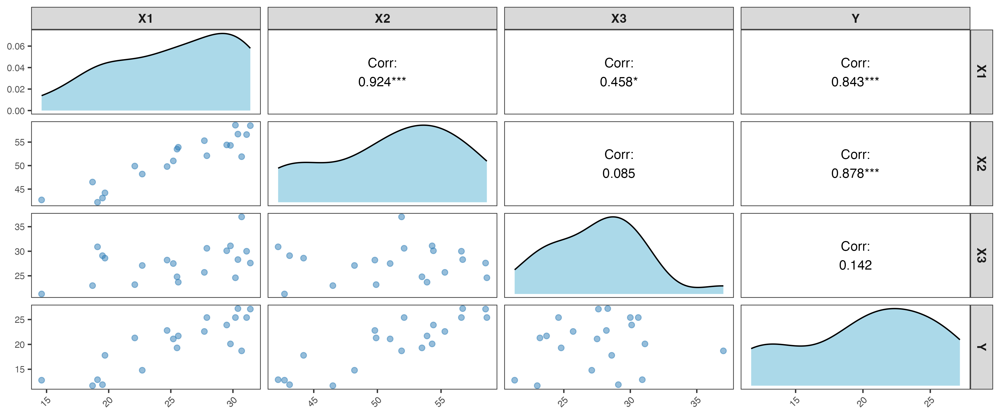

```{r setup, include=FALSE}
knitr::opts_chunk$set(warning = FALSE, message = FALSE)
```

```{r, include=FALSE}
#Importando bibliotecas
library(ggplot2)
library(readr)
library(tidyr)
library(tidyverse)
library(stringr)
library(magrittr)
library(lubridate)
library(knitr)
library(dplyr)
library(kableExtra)
library(GGally)
library(ggplot2)
library(ggcorrplot)
library(gridExtra)
 cores_base <- c("#ABD9E9", "#2C7BB6",'grey')
```

## Introdução

Nesta atividade vocês irão trabalhar os seguintes conceitos:

* regressão linear múltipla;
* tabela ANOVA;
* soma extra de quadrados para testar hipóteses sobre os coeficientes;
* coeficientes de determinação múltiplo e parcial.


## Atividade 1: Gordura Corporal

Considere os dados sobre gordura corporal em anexo. Esses são os mesmos dados que foram utilizados nos slides apresentados em aula. O interesse está em explicar a relação entre a taxa de gordura corporal ($Y$) e três medidas corporais:  

* $X1$: espessura da dobra cutânea do tríceps;
* $X2$: circunferência da coxa; e
* $X3$: circunferência do meio do braço.

1) Faça uma matriz com os gráficos de dispersão entre os pares de variáveis e também as correlações. Qual a correlação das preditoras com a variável resposta? As variáveis preditoras são correlacionadas entre si?

```{r}
dados <- read.table("fat.txt", 
                   col.names = c("X1", "X2", "X3", "Y"))

```

```{r exibir_questao, echo=FALSE, out.width="90%", fig.align='center'}
# Este chunk exibe a imagem salva sem mostrar o código

```


```{r echo = FALSE}
#### CRIANDO MATRIZ COMM GRAFICOS DE DISPERSAO. 

### nao exibir esse codigo
# 
# ggsave("matriz_dispersao.png", width = 12, height = 5, dpi = 300)
# ggpairs(
#   dados,
#   upper = list(continuous = wrap("cor", size = 4, color = "black")),  
#   lower = list(continuous = wrap("points", alpha = 0.5, size = 2, color = "#2C7BB6")),
#   diag = list(continuous = wrap("densityDiag", fill = "#ABD9E9"))
# ) +
#   theme_bw(base_size = 12) + 
#   theme(
#     plot.title = element_text(size = 18, face = "bold", hjust = 0.5),
#     strip.text = element_text(size = 11, face = "bold"),
#     axis.text.x = element_text(size = 8, angle = 45, hjust = 1),
#     axis.text.y = element_text(size = 8),
#     panel.grid.major = element_blank(),
#     panel.grid.minor = element_blank(),
#     panel.background = element_rect(fill = "white", color = "gray90"),
#     plot.background = element_rect(fill = "white", color = NA)
#   )
```

```{r matriz_correlacao }


matriz_cor <- round(cor(dados),2)

ggcorrplot(
  method = "square",show.diag = TRUE,matriz_cor,type = "upper",lab = TRUE,lab_size = 2.5,
  tl.cex = 12,tl.srt = 45,digits = 2 ,colors = cores_base,outline.color = "black",
  title = "Matriz de Correlação") + theme(plot.title = element_text(hjust = 0.5, 
  face = "bold", color = "#1A4A7A"),axis.text.x = element_text(angle = 45, hjust = 1))

corX1_Y = cor(dados$X1,dados$Y)
corX2_Y = cor(dados$X2,dados$Y)
corX1_X2 = cor(dados$X1,dados$X2)
```

### Análise da Matriz de Correlação

Observa-se que as variáveis preditoras **X1** e **X2** apresentam forte correlação com a variável resposta **Y** (0.84 e 0.88, respectivamente), indicando que ambas possuem grande poder explicativo em relação a **Y**.  

No entanto, nota-se também que **X1** e **X2** são altamente correlacionadas entre si (0.92), o que sugere a presença de **multicolinearidade**. Essa forte relação entre os dois preditores pode causar redundância de informação no modelo e dificultar a interpretação dos coeficientes.  

Por outro lado, a variável **X3** apresenta correlação baixa com **Y** (0.14) e fraca correlação com as demais preditoras, indicando que ela pode trazer informação complementar ao modelo sem contribuir para o problema de multicolinearidade.


2) Ajuste um modelo de regressão linear múltipla usando $X_1$, $X_2$ e $X_3$ como preditores, ou seja,
$$Y_i = \beta_0 + \beta_1 X_{1i} + \beta_2 X_{2i} + \beta_3 X_{3i} + \varepsilon_i.$$

    Reporte as estimativas dos coeficientes e interprete-os. Qual é função de regressão estimada?
    

```{r}
# Ajustando o modelo com os preditores X1,X2,X3
modelo = lm(Y ~ X1+X2+X3,data = dados)
summary(modelo)
# Escrevendo a funcao de regressao linear com 4 casas decimais
b <- coef(modelo)
cat(sprintf("Ŷ = %.4f + %.4f·X1 + %.4f·X2 + %.4f·X3\n",
            b[1], b[2], b[3], b[4]))
```
## Análise do Modelo de Regressão com Preditores X1, X2 e X3

O modelo de regressão linear múltipla ajustado é representado por:
$$
\widehat{Y} =  117.08 - 4.33 \cdot X1 -2.85 \cdot X2  -2.18 \cdot X3
$$

Interpretação Detalhada dos Coeficientes


Este modelo de regressão linear múltipla busca explicar o percentual de gordura corporal (Y) a partir de três medidas corporais :

- $X_1$: Espessura da dobra cutânea do tríceps
- $X_2$: Circunferência da coxa 
- $X_3$: Circunferência do meio do braço.

Cada coeficiente $\beta_j$ representa o efeito parcial do seu preditor sobre $Y$, mantendo os outros preditores constantes.
Da análise, o intercepto $\beta_0$, quando $X_1 = X_2 = X_3 = 0$, é de $117{,}0847$.
O coeficiente de $X_1$ é $\beta_1 = 4{,}3341$; isto é, quando $X_2$ e $X_3$ são fixos, um aumento de 1 unidade em $X_1$ produz, em média, um aumento de $4{,}33$ unidades no percentual de gordura corporal.
O coeficiente de $X_2$ é $\beta_2 = -2{,}8568$; isto é, quando $X_1$ e $X_3$ são fixos, um aumento de 1 unidade em $X_2$ se associa a uma diminuição de $2{,}86$ unidades na gordura corporal. Ao manter fixo $X_1$, uma coxa maior pode indicar uma maior massa corporal não gorda. Além disso, a forte correlação entre $X_1$ e $X_2$, que se pode ver do inciso anterior e que é de $0{,}92$, gera colinearidade, o que pode inverter sinais.
O coeficiente de $X_3$ é $\beta_3 = -2{,}1861$; isto é, quando $X_1$ e $X_2$ são fixos, um aumento de 1 unidade em $X_3$ se associa a uma diminuição de $2{,}19$ unidades na gordura corporal.

**Nenhum dos coeficientes tem p-valor < 0.05, então nenhum preditor é estatisticamente significativo individualmente nesse modelo (ao nível de 5%).**


3) Obtenha a tabela ANOVA para o modelo ajustado usando os 3 preditores. Explique as somas de quadrados apresentados nesta tabela ANOVA.

```{r echo=FALSE}
## (1) ANOVA Tipo I (secuencial): lo que muestra anova(modelo)
#   - Fila X1: SSR(X1)
#   - Fila X2: SSR(X2 | X1)
#   - Fila X3: SSR(X3 | X1, X2)
anova(modelo)

## (2) ANOVA global (2 filas: Regressão vs Erro)
anova(lm(Y ~ 1, data = dados), modelo)  # compara modelo nulo vs modelo completo

## (3) Tabla ANOVA "compacta" construida a mano (útil para el informe)
n  <- nrow(dados)
SSE <- sum(residuals(modelo)^2)  # Soma dos quadrados dos erros
SST <- sum((dados$Y - mean(dados$Y))^2)  # Soma total dos quadrados
SSR <- SST - SSE  # Soma dos quadrados da regressão

df_reg <- 3                 # 3 predictores
df_err <- n - 4             # n - (1 + 3)
df_tot <- n - 1

MSR <- SSR / df_reg
MSE <- SSE / df_err
F   <- MSR / MSE
p   <- pf(F, df_reg, df_err, lower.tail = FALSE)

ANOVA_global <- data.frame(
  Fonte   = c("Regressão", "Erro", "Total"),
  gl      = c(df_reg, df_err, df_tot),
  SQ      = c(SSR, SSE, SST),
  QM      = c(MSR, MSE, NA),
  F       = c(F, NA, NA),
  `Pr(>F)`= c(p, NA, NA)
)
# ANOVA_global
```

A ANOVA (Análise de Variância) na regressão serve para decompor a variabilidade total de Y (a variável resposta) em duas partes:

$SQTotal$  =  $SQRegressao$  +  $SQErro$


Ou seja as **somas de quadrados** quantificam a variação da variável resposta \( Y \):

- **SQTotal (SST)** representa a variação total de \( Y \) em torno da média. 
$$
SQ_{Total} = \sum_{i=1}^{n} (Y_i - \bar{Y})^2 
$$
 $SQTotal$ = 495.38950	

- **SQRegressão (SSR)** mede a parte da variação explicada pelo modelo (pelos preditores).  

$$
SQ_{Reg} = \sum_{i=1}^{n} (\hat{Y}_i - \bar{Y})^2 = 
$$
 $SQReg$ = 396.98461	

- **SQErro (SSE)** representa a variação não explicada pelo modelo, ou seja, o ruído ou erro aleatório.  

$$
SQ_{Erro} = \sum_{i=1}^{n} (Y_i - \hat{Y}_i)^2 = 
$$
$SQErro$ = 98.40489	

4) Preencha a tabela ANOVA a seguir:

```{r echo=FALSE}
knitr::kable(
  ANOVA_global,
  digits = 5,
  # caption = "Tabela ANOVA construída manualmente a partir do modelo ajustado"
)
```
    


  A partir desta tabela ANOVA, faça um teste F para verificar se os coeficientes 
$\beta_1$, $\beta_2$ e $\beta_3$ são todos não nulos. Quais são as hipóteses sendo testadas, a estatística do teste e conclusão.


### Teste F Global da Regressão

A partir da tabela ANOVA, realiza-se o teste \( F \) para verificar se os coeficientes 
\(\beta_1\), \(\beta_2\) e \(\beta_3\) são todos nulos.

As hipóteses do teste são:

$$
\begin{cases}
H_0: \beta_1 = \beta_2 = \beta_3 = 0 \\
H_1: \text{ao menos um } \beta_j \neq 0
\end{cases}
$$

Comparando o modelo nulo \( Y \sim 1 \) com o modelo completo \( Y \sim X_1 + X_2 + X_3 \),
obtém-se:

- \( gl_{\text{Regressão}} = 3 \), \( SQ_{\text{Regressão}} = 396{,}98 \), \( QM_{\text{Regressão}} = 132{,}33 \)
- \( gl_{\text{Erro}} = 16 \), \( SQ_{\text{Erro}} = 98{,}40 \), \( QM_{\text{Erro}} = 6{,}15 \)
- \( gl_{\text{Total}} = 19 \), \( SQ_{\text{Total}} = 495{,}39 \)

A estatística do teste é:

$$
F = \frac{QM_{\text{Regressão}}}{QM_{\text{Erro}}} = 21{,}516
$$

com p-valor \( = 7{,}343 \times 10^{-6} \).

Como o p-valor é muito pequeno (\( p < 0{,}05 \)), **rejeita-se \( H_0 \)** e conclui-se que o
modelo com os três preditores é **globalmente significativo**, ou seja, pelo menos um dos
coeficientes \(\beta_j\) é diferente de zero.

    
<!-- A partir da comparação do modelo nulo $Y \sim 1$ com o modelo completo $Y \sim X_1 + X_2 + X_3$, obtém-se, na regressão, $3$ g.l., com $SQ_{\text{Regressão}} = 396{,}98$, $QM_{\text{Regressão}} = 132{,}33$, um $F = 21{,}516$ e um p\text{-}valor de $7{,}343 \times 10^{-6}$. Por outro lado, no erro, com $16$ g.l., tem-se $SQ_{\text{Erro}} = 98{,}40$, $QM_{\text{Erro}} = 6{,}15$, e no total, com $19$ g.l., tem-se $SQ_{\text{Total}} = 495{,}39$.  -->
<!-- O teste $F$ global para este modelo é $H_0: \beta_1 = \beta_2 = \beta_3 = 0$ vs $H_1:$ ao menos um $\beta_j \neq 0$. Como se obteve $F = 21{,}516$ e p\text{-}valor $= 7{,}343 \times 10^{-6}$, rejeita-se $H_0$ e conclui-se que o modelo com os 3 preditores é globalmente significativo. -->

5) Usando a função `summary()`, obtenha a tabela dos coeficientes, juntamente com os testes t para cada coeficiente. Se você tivesse que escolher um preditor para excluir do modelo, qual seria? Justifique.

6) Construa um teste para verificar se $\beta_2 = 0$ usando as somas extras de quadrados, ou seja, verifique se o efeito da variável $X_2$ é significativo para explicar $Y$, considerando que $X_1$ e $X_3$ estão no modelo. 

7) O teste F do item anterior é equivalente a qual teste t do item 5)? Qual a relação entre as estatísticas do teste? Interprete esse resultado.

8) Obtenha a tabela ANOVA que decompõe a $SQReg$ em $SQ(X_2)$, $SQ(X_1 | X_2)$ e $SQ(X_3 | X_1, X_2)$. Como executar isso no `R`?

9) Teste se ambos os preditores $X_1$ e $X_3$ podem ser excluídos do modelo, dado que $X_2$ é mantido no modelo. Escreva as hipóteses, estatística do teste e conclusão para um nível de significância $\alpha = 0.05$.

10) Encontre o coeficient de determinação $R^2$ da regressão linear simples quando apenas $X_2$ está no modelo. Interprete.

11) Encontre o coeficiente de determinação múltiplo e ajustado, $R^2$ e $R^2_{adj}$, respectivamente, quando os três preditores estão no modelo. Interprete-os.

12) Calcule o coeficiente de determinação de $Y$ com $X_1$ e $X_3$, dado que $X_2$ está no modelo. Interprete.

13) Depois de toda essa análise, ajuste o modelo que você considera mais apropriado para explicar a taxa de gordura corporal. 

14) Faça a análise de resíduos com para este modelo que você ajustou no item 13.
